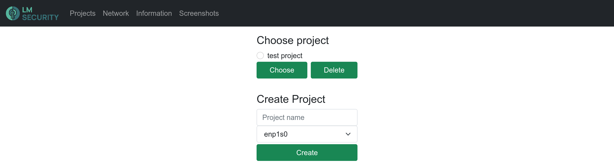
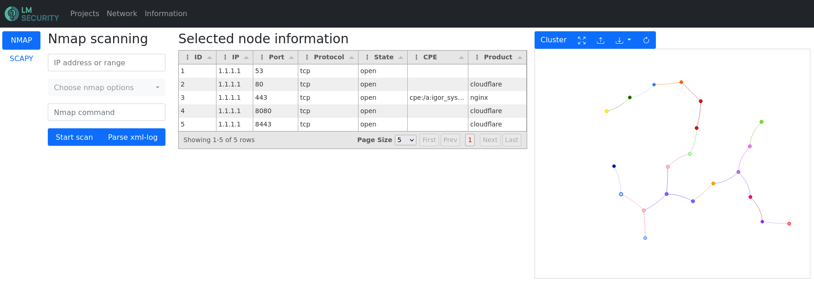
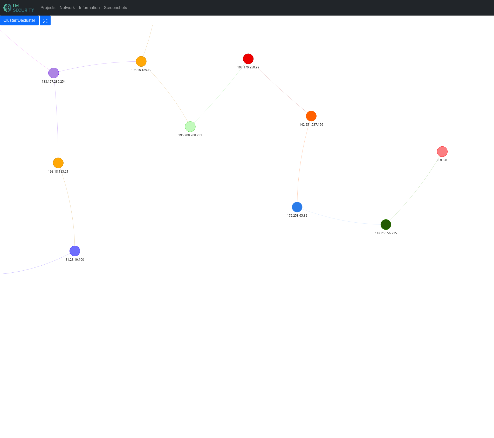
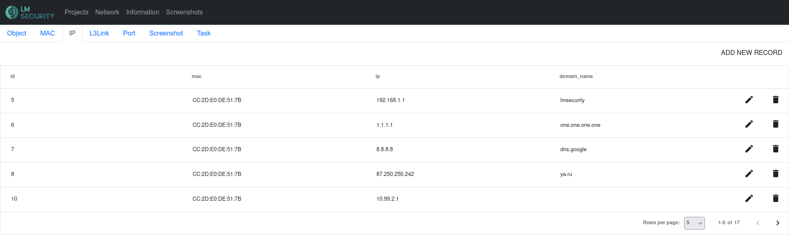

# **LMS.NetMap**

### Table of contents
1. [Desctiprion](#description)
1. [Screenshots](#screenshots)
1. [Features](#features)
1. [Before run](#before-run)
1. [Usage](#usage)
1. [Database schema](#database-schema)
1. [Features in new version](#features-in-new-version)

### Description
**LMS.NetMap** - сетевой анализатор трафика с возможностью автоматического построения топологии сети. 

### Screenshots





### Features
- активное сканирование (nmap)
- пассивное сканирование (scapy)
- построение  топологии сети на основе проведенных сканирований или логов (nmap xml, pcap)
- разделение на проекты
- кластеризация / декластеризация узлов по 24 маске
- предствление найденной информации в табличном виде
- ручное редактирование записей талицы на веб-морде

### Before run
Перед запуском приложения происходит проверка софта. Если какие-то пакеты не установлены - приложение упадет с ошибкой. Если не совпадают версии - будет соответствующее уведомление и приложение запустится.
#### Software requirements
1. python3
1. nmap
1. scapy (для того, чтобы пассивное сканирование со scapy не требовало прав root, выполните `sudo setcap cap_net_raw=eip /usr/bin/pythonX.X`)
1. добавить пользователя `nmap` и добавить в группу, чтобы выполнять сканирование с параметрами, которые требуют админские права:
``` bash
sudo groupadd nmap
sudo usermod -aG nmap $USER
newgrp nmap
```
#### Packages requirements
1. cryptography==2.8
1. scapy==2.4.5
1. iptools==0.7.0
1. pandas==1.4.1
1. aiohttp_jinja2==1.5
1. SQLAlchemy==1.4.32
1. xmltodict==0.12.0
1. aiohttp==3.8.1
1. aiohttp_session==2.11.0
1. Jinja2==3.1.2
1. sqlalchemy_schemadisplay==1.3
1. aiojobs==1.0.0
Чтобы установить пакеты. выполните: 
``` bash
pip3 install -r requirements.txt
```

### Usage
#### Native
```bash 
python3 app.py
```
Приложение будет доступно по адресу `http://localhost:8008`
#### Docker
Имеется возможность поднять приложение в `docker`-контейнере:
``` bash
docker-compose up --build
```
Приложение будет доступно по адресу `http://localhost:8001`

### Database schema


### Features in new version
1. Возможность скармливать логи других инструментов:
    - whatweb
    - crackmapexec
    - nikto
    - gobuster
    - и другие
1. Расширенный анализ nmap сканирования
1. Увеличить количество типов анализуруемых пакетов и качество парсинга пакетов
1. Работа с доменными именами
1. Поиск сервисов по dns записям и субдоменам
1. Создание скриншотов веб-приложений
1. Проксирование запросов
