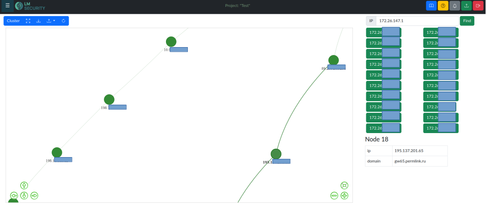

# **Setezor**

### Table of contents
[Description](#description)

[Features](#features)

[Requirements](#requirements)

[Usage](#usage)

[Database schema](#database-schema)

[Features in new version](#features-in-new-version)

### Screenshots





### Description
**Setezor** is a network traffic analyzer with the ability to automatically build network topology. 
### Features
1. **Separation into projects**. In order not to "keep all eggs in one basket" the division into projects is implemented. User's belonging to a project is determined by a cookie. Unless a user has a cookie, he/she cannot start working with a project.
1. **Active scanning using nmap**. Integration with natively installed `nmap` has been done. Currently, from the scan results are pulled:
    - host information (IP, MAC, hostname);
    - trace information;
    - port information (port number, state, software information on the port).
1. **Active scanning using masscan**. Integration with natively installed `masscan` is performed.
1. **Parsing nmap scan xml logs**. Performed a scan on a remote machine and want to upload the logs to your project? No problem, `Setezor` supports parsing of `nmap` xml logs
1. **Parsing masscan** scan xml/list/json logs.
1. **Passive scanning using scapy**. Scapy is a powerful networking tool. The application creates an asynchronous sniffer and "guts packets" on the fly. Right now, you can get information from the following packet types:
    - ARP;
    - LLNMR;
    - NBNS;
    - TCP.

1. **Parsing pcap files**. You have done packet sniffing and want to load data into your project? No problem, `Setezor` supports pcap-files parsing.
1. **Parsing is organized as tasks**. All parsing of parsing logs is organized as tasks and executed on the server side in separate schedulers. It is possible to configure each scheduler individually to control outgoing traffic.
1. **Building network topology**. Network topology is automatically built on the basis of scan data with the following functions:
    - automatic rebuilding of the network map when new data is received;
    - interactive network map with the possibility of working in full-screen mode;
    - obtaining data on open ports for a selected network node;
    - possibility to set the role of a network node and install an icon;
    - network nodes clustering by 24 mask. Very convenient when there are 100500 nodes on the map;
    - export of network topology in `SVG`, `PNG` and `JSON` (vis.js data structure);
    - importing network topology from `JSON` (vis.js data structure);
1. **Notifications**. When the status of a task changes, a notification pops up to inform the user

1. **Working with the base through the web interface**. The web interface has an element for working with the database that supports the following functionality:
    - displaying a record;
    - record creation
    - record editing;
    - deleting a record.
1. **Use of REST API**. REST API is used to work with the server part, so it is possible to write your own interface (tui, gui native, mobile) or integrate it into your project.

### Requirements
#### Software requirements
1. python3.12
1. nmap
2. masscan
3. libpcap2-bin
4. python3-pip

#### Packages requirements

```
aiodns==3.2.0
aiofiles==24.1.0
aiohttp==3.10.3
aiohttp_jinja2==1.6
aiohttp_session==2.12.0
aiojobs==1.3.0
alembic==1.13.2
click==8.1.7
colorama==0.4.6
cryptography==43.0.0
dnspython==2.6.1
iptools==0.7.0
Jinja2==3.1.4
mac_vendor_lookup==0.1.12
nest_asyncio==1.6.0
orjson==3.10.7
pandas==2.2.2
purl==1.6
pydantic==2.8.2
pydantic_extra_types==2.9.0
pyOpenSSL==24.2.1
pyOpenSSL==24.2.1
pyroute2==0.7.12
pytest==8.3.2
Requests==2.32.3
scapy==2.5.0
setuptools==72.2.0
SQLAlchemy==2.0.32
sqlalchemy_schemadisplay==2.0
typing_extensions==4.12.2
xmltodict==0.13.0
```
### Usage
#### From github repo
1. Clone a repository from github 
```bash
git clone https://github.com/lmsecure/Setezor.git
cd Setezor
```
2. Install the necessary software
```bash
sudo apt install nmap python3.12
```
2.1. It is recommended that `venv` be used
```bash
sudo apt install -y python3-venv
python3 -m venv venv
source venv/bin/activate
```
3. Install dependent packages. 
```bash
pip3 install -r setezor/requirements.txt
```
4. Grant socket permissions for `nmap` and `python3.12`
```bash
sudo setcap cap_net_raw=eip "$(readlink -f `which venv/bin/python3.12`)"
sudo setcap cap_net_raw,cap_net_admin,cap_net_bind_service+eip `which nmap`
```
5. Start the application
```bash

python3 setezor/setezor.py
```
#### From github pyz-file from last release
1. Download the release file from github
```bash
wget https://github.com/lmsecure/Setezor/releases/download/v0.4a/app-v0.4a.pyz
cd Setezor
```
2. Install the necessary software
```bash
sudo apt install nmap python3.12
```

#### From dockerhub image
1. Download docker image
```bash
docker pull lmsecure/setezor
```
2. Create a working folder. It will be used to store logs and user data
```bash
mkdir ~/setezor && cd $_
```
3. Start the docker container
```bash
docker run -p 16661:16661 --network=host -v ~/setezor/projects:/setezor/projects -v ~/setezor/logs:/setezor/logs -d lmsecure/setezor:latest
```
After launching, go to `http://localhost:16661`


### Database schema


### Features in new version
1. Ability to parse logs from other instruments:
    - whatweb
    - crackmapexec
    - nikto
    - gobuster
    - and others
1. Advanced analysis of nmap scans
1. Increase the number of analyzed packet types and the quality of packet parsing
1. Work with domain names
1. Search services by dns records and subdomains
1. Creating screenshots of web applications
1. Proxying requests

