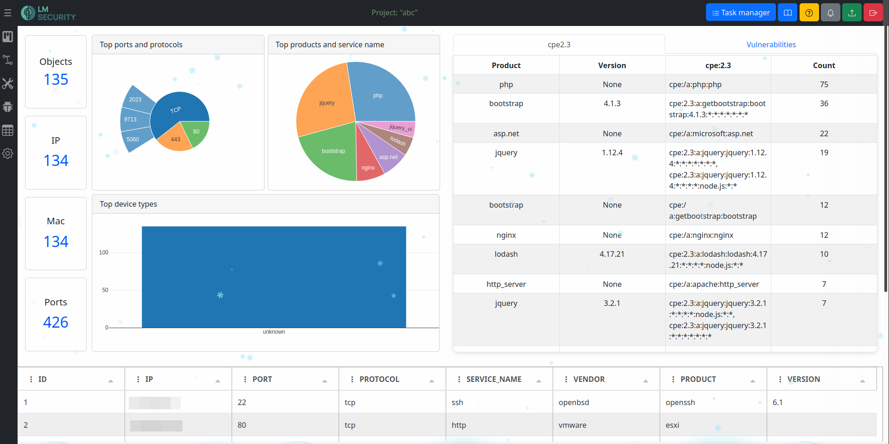
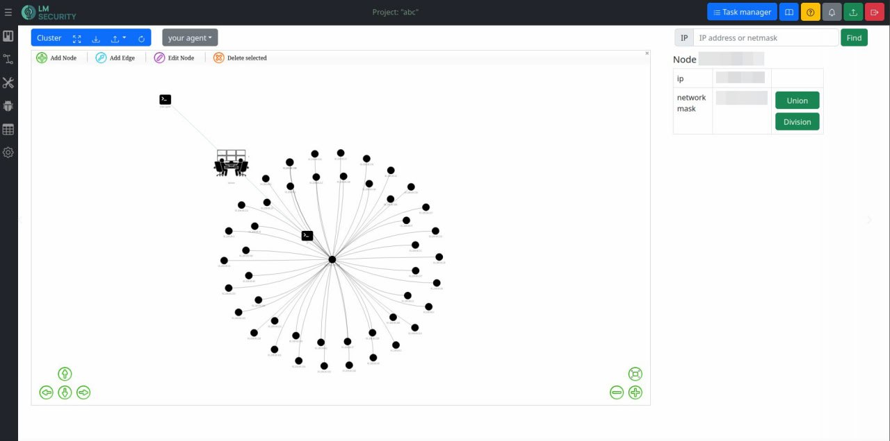
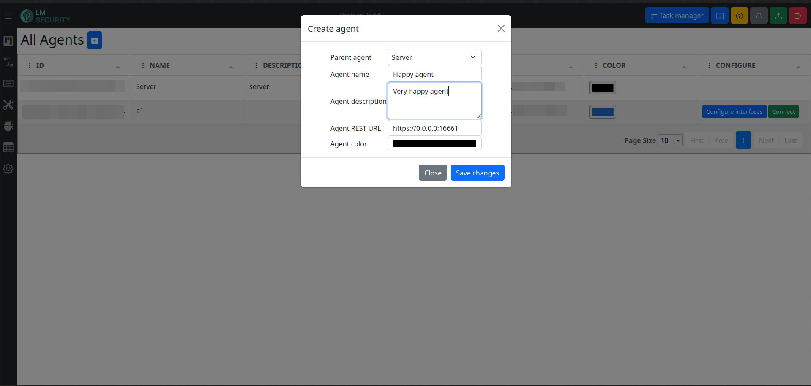
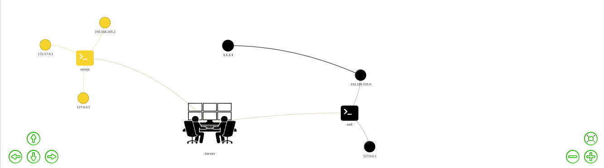

### Содержание
1. [Что такое Сетезор?](#что-такое-сетезор)
2. [Возможности Сетезор](#возможности-сетезор)
3. [Установка и запуск](#установка-и-запуск)
4. [Контакты](#контакты)
5. [Донаты](#донаты)

##### Снимки экрана






### Что такое Сетезор?
 **Setezor** (Сетезор, ранее LMS.NetMap)- швейцарский нож для анализа и проектирования сетевой инфраструктуры. Данный инструмент будет полезен пентестерам, сетевикам, системным администраторам.
 
##### Возможности Сетезор:
- Работа с веб-интерфейсом;
- Разделение на проекты;
- Табличное представление данных с возможность применения фильтров, экспорт в формате электронной таблицы;
- Генерация снимка экрана веб-ресурса;
- Поиск программного обеспечения по узлам сети;
- Активное и пассивное сканирование с использованием nmap, masscan и scapy;
- Парсинг pcap-файлов, xml-логов сканирования nmap, xml/list/json-логов сканирования masscan;
- Получение информации организовано в виде задач, при изменении статуса задачи всплывает уведомление;
- Получение списка уязвимостей для конкретного ПО посредством интеграции с search-vulns;
- Формирование отчёта по найденным уязвимостям;
- Поиск сетевых узлов по протоколу SNMP и сбор установленного программного обеспечения;
- Автоматическое построение карты сети на L3 уровне;
- Поиск субдоменов через DNS;
- Получение SSL сертификата;
- Получение детальной информации о регистре домена;
- HTTP REST API – унифицированный веб-интерфейс для взаимодействия с клиентской частью приложения и интеграциями с другими информационными системами.

###  Системные требования
##### Аппаратное обеспечение

| **Минимальные требования**                                                                                                                                                                                               | **Рекомендованные требования**                                                                                                                                                                                             |
| ------------------------------------------------------------------------------------------------------------------------------------------------------------------------------------------------------------------------ | -------------------------------------------------------------------------------------------------------------------------------------------------------------------------------------------------------------------------- |
| Процессор: 4-ядерный с тактовой частотой 2 ГГц и больше<br>    <br>Оперативная память: 2 ГБ<br>    <br>Видеокарта (память): 2 ГБ<br>    <br>Сеть: Широкополосное подключение к интернету<br>    <br>Место на диске: 5 ГБ | Процессор: 4-ядерный с тактовой частотой 2.5 ГГц и больше<br>    <br>Оперативная память: 4 ГБ<br>    <br>Видеокарта (память): 4 ГБ<br>    <br>Сеть: Широкополосное подключение к интернету<br>    <br>Место на диске: 5 ГБ |

##### Программное обеспечение

| **Минимальные требования**                                                                                                                                                                                                                                                                                                                                                                                                                               | **Рекомендованные требования**                                                                                                                                                                                                                                                                                                                                                                                                                      |
| -------------------------------------------------------------------------------------------------------------------------------------------------------------------------------------------------------------------------------------------------------------------------------------------------------------------------------------------------------------------------------------------------------------------------------------------------------- | --------------------------------------------------------------------------------------------------------------------------------------------------------------------------------------------------------------------------------------------------------------------------------------------------------------------------------------------------------------------------------------------------------------------------------------------------- |
| Поддерживаемые ОС:  <br>         Linux (Ubuntu вер. 19.10 «Eoan Ermine» и выше)  <br>    <br>Поддерживаемые веб-браузеры:  <br>         Yandex Browser (вер. 18.2.1)  <br>         Google Chrome (вер. 88)  <br>         Opera (вер. 65.2.3381.61420)  <br>         Mozilla Firefox (вер. 104)  <br>         Safari (вер. 13.1.2)  <br>         Microsoft Edge (вер. 105)<br>    <br>Python: вер. 3.12<br>python3-pip<br>Nmap<br>Masscan<br>libpcap2-bin | Поддерживаемые ОС:  <br>         Linux (Ubuntu вер. 23.04 «Lunar Lobster» и выше)  <br>    <br>Поддерживаемые веб-браузеры:  <br>         Yandex Browser (вер. 24.6.3.729)  <br>         Google Chrome (вер. 129)  <br>         Opera (вер. 114)  <br>         Mozilla Firefox (вер. 130)  <br>         Safari (вер. 16.5.2)  <br>         Microsoft Edge (вер. 126)<br>    <br>Python: вер. 3.12<br>python3-pip<br>Nmap<br>Masscan<br>libpcap2-bin |

### Установка и запуск
Существуют 3 варианта установки «Сетезор» на свой компьютер: GitHub, DEB-пакет и Docker образ:
1. GitHub: [https://github.com/lmsecure/Setezor](https://github.com/lmsecure/Setezor)
2. DEB-пакет, расположенного в «Релизы» на GitHub в ZIP-архиве: [https://github.com/lmsecure/Setezor/releases]( https://github.com/lmsecure/Setezor/releases)
3. Docker образ: [https://hub.docker.com/r/lmsecure/setezor](https://hub.docker.com/r/lmsecure/setezor)

###### Установка и запуск с DEB-пакета:
1. Скачать установочный DEB-пакет. При установке убедиться, что вы расположены в директории с DEB-пакетом, иначе прописать полный путь:
```bash
sudo apt install ./setezor_<версия>.deb
```
2. Объявить переменные окружения:
```
export SERVER_REST_URL=https://<ip/domain>:<port>
export SECRET_KEY=abcdef
```
3. Запустить Сервер:
```bash
 $ setezor
```
_4. Запустить Агента:
```bash
 $ setezor -s -p <port>
```

###### Установка и запуск Docker образа:
1. Загрузить образ «Сетезор» с репозитория: [https://hub.docker.com/r/lmsecure/setezor](https://hub.docker.com/r/lmsecure/setezor)
```bash
docker pull lmsecure/setezor
```
1. Создать рабочую папку. Она будет нужна для хранения логов и пользовательских данных:
```bash
mkdir ~/setezor && cd $_
```
1. Создать .env файл и прописать в него переменные:
```
SECRET_KEY=abcdef
SERVER_REST_URL=https://<ip/doamin>:<port>
```
1. Запустить Сервер:
```bash
docker run -p 16661:16661 --env-file .env --network=host -v ~/setezor:/root/.local/share/setezor -d lmsecure/setezor:latest
```
1. Запустить Агента:
```bash
docker run --network=host --cap-add=NET_ADMIN -d lmsecure/setezor:latest -s -p 16662
```

**Функционал CLI:**
1. Просмотр всех доступных опций: `- setezor --help`
2. Просмотр пользователей:  `setezor list-users`
3. Сброс пароля: `setezor reset-password -l \<username\>`

**Добавление агента:**
На странице «Settings находятся все агенты проекта и сервер. Для создания нового агента нажать на «+» возле надписи «All Agents» выбрать: 
- какой агент (родитель) имеет доступ к создаваемому агенту: сервер или другой агент
- задать имя агента
- описание
- ввести IP-адрес машины, на которой будет агент
- выбрать цвет агента на карте сети



Каждый агент имеет свой уникальный зашифрованный номер, который отображается в столбце «ID» таблицы «All Agents» . В столбце «CONFIGURE» есть две кнопки: 
- Configure interfaces: позволяет выбрать интерфейс агента;
- Connect: подключить агента.

Агент отображается в разделе «Network Map» на Карте сети. Все Агенты имеют связь с Сервером. У каждого Агента есть интерфейс из которого идут ноды.



### Контакты
- Telegram-канал: [https://t.me/setezor](https://t.me/setezor)  
- Telegram-чат: [https://t.me/netmap_chat](https://t.me/netmap_chat  )
- Сайт проекта: [https://setezor.ru](https://setezor.ru)

### Донаты
- Bitcoin: bc1qa2evk7khm246lhvljy8ujqu7m9m88gt84am9rz
- Dash: XoJ3pBDG6f5L6NwoqUqg7dpeT9MHKcNtwT

Принимаем любые криптовалюты - пишите добавим другие.
