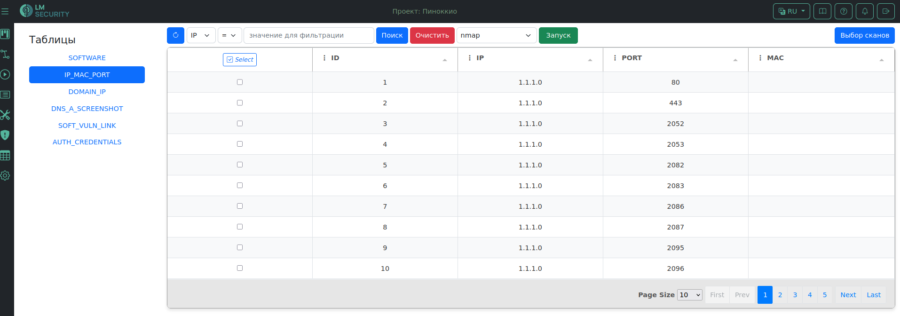

# Навигация
1. [Что такое Сетезор?](#что-такое-сетезор)
2. [Особенности](#особенности-сетезор)
3. [Установка и запуск](#установка-и-запуск)
4. [Установка и запуск агента на сервере](#установка-и-запуск-агента-на-сервере)
5. [Поддержка](#поддержка)
6. [Донаты](#донаты)




# Что такое Сетезор?
 **Setezor** (Сетезор, ранее LMS.NetMap) - это аналитический инструмент, предназначенный для мониторинга, анализа и оптимизации сетевых операций. Он собирает и анализирует данные из различных источников в сети. Открывает новые горизонты для специалистов в области информационной безопасности, сетевых технологий и системного администрирования. 
 
 Вот ключевые преимущества, которые делают его незаменимым в работе:
- Веб-интерфейс «HTTP REST API» на серверной части.
- Задачи выполняются только на агентах, но там отсутствует веб-интерфейс и управление с сервера.
- Авторизация и регистрация в ПО Сетезор.
- Приглашение в Сетезор или проект по токену.
- Смена языка интерфейса: английский или русский.
- Разделение на проекты.
- Визуальное отображение данных в таблицах и диаграммах.
- Автоматическое построение карты сети на L3-уровне. 
- Формирование группы целей (скоупы и таргеты), позволяют создавать группы IP-адресов, портов и доменов и группами сканировать информацию.
- Выявление ИТ-активов и инвентаризация ИТ-инфраструктуры.
- Получение информации в виде задач, при изменении статуса задачи всплывает уведомление.
- Сканирование сети инструментами NMAP, MASSCAN, SCAPY, SNMP.
- Сканирование веб-приложений инструментами Domains, TLS/SSL CERT, WHOIS, WAPPALYZER.
- Сканирование на обнаружение уязвимостей инструментами ACUNETIX, CPEGuess, SearchVulns.
- Выявление потенциально опасных протоколов обмена (открытые и закрытые порты).
- Интеграция различных инструментов (загрузка логов, управление инструментами)
- Загрузка xml-логов, pcap-логов, xml-логов, list-логов, json-логов сканирования.
- Поиск программного обеспечения по узлам сети и его версии.
- Поиск субдоменов через DNS.
- Получение SSL-сертификата.
- Получение списка уязвимостей для конкретного ПО инструментом SearchVulns.
- Поиск строки методом Brute-force SNMP community string.

# Установка и запуск
Мы разделили Сетезор на два отдельных приложения - сервер и агенты. Серверная часть имеет оболочку в виде веб-интерфейса, на нем создаются задачи. Агентская часть не имеет оболочки и содержит только инструменты. 

При первом запуске Сетезор заполняется база данных и вместе с ней пароль для администратора "Admin password". Его необходимо **сохранить** и **запомнить**.

## Сервер
####  DEB-пакет
Скачать deb-пакет с репозитория [https://github.com/lmsecure/Setezor/releases]( https://github.com/lmsecure/Setezor/releases). При установке убедиться, что вы расположены в директории с DEB-пакетом, иначе прописать полный путь:

```bash
sudo apt install ./setezor_<версия>.deb
```

Объявить переменные окружения:

```bash
export SERVER_REST_URL=https://<ip/domain>:<port>
export SECRET_KEY=abcdef
```

Запустить сервер:

```bash
setezor
```

#### Docker-образ
Загрузить образ сервера с репозитория: [https://hub.docker.com/r/lmsecure/setezor](https://hub.docker.com/r/lmsecure/setezor)

```bash
docker pull lmsecure/setezor:latest
```

Создать рабочую папку. Она будет нужна для хранения логов и пользовательских данных:

```bash
mkdir ~/setezor && cd $_
```

Создать файл ".env" и прописать в него переменные:

```
SECRET_KEY=abcdef
SERVER_REST_URL=https://<ip/doamin>:<port>
```

Запустить Сервер:
```bash
docker run -p 16661:16661 --env-file .env --network=host -v ~/setezor:/root/.local/share/setezor -d lmsecure/setezor:latest
```

## Агент
####  DEB-пакет
Скачать deb-пакет с репозитория  [https://github.com/lmsecure/Setezor.Agent/releases](https://github.com/lmsecure/Setezor.Agent/releases) и установить командой: 

```bash
sudo apt install ./setezoragent_<версия>.deb
```

Запустить агента: 

```bash
setezoragent -p <порт>
```

#### Docker-образ
Загрузить образ агента с репозитория [https://hub.docker.com/r/lmsecure/setezor.agent/tags](https://hub.docker.com/r/lmsecure/setezor.agent/tags).

```bash
docker pull lmsecure/setezor.agent:latest
```

Запустить агента: 

```bash
docker run --network=host --cap-add=NET_ADMIN -d lmsecure/setezor.agent:latest
```

## Функционал CLI

- Просмотр всех доступных опций на сервере:

```bash
setezor --help
```

- Просмотр всех доступных опций на агенте:

```bash
setezoragent --help
```

- Просмотр пользователей: 

```bash
setezor list-users
```

-  Сброс пароля:

```bash
setezor reset-password -l <username>
```


# Установка и запуск агента на сервере
Агент выступает в роли исполнителя заданий, приходящих с сервера, а также в роли посредника, пересылающего данные следующему агенту, который может являться исполнителем. Он сканирует сеть, взаимодействуя с инструментами Сетезор. Умеет подключаться не только через сервер, но и через другого агента. Подключенный агент может быть привязан ко всем проектам.

Стартовая страница **«Проекты»**, через шапку веб-страницы перейти **«Админские настройки»** и **добавить агента**.


**Создать проект** и привязать агента к проекту перейдя на страницу **«Настройки»** → **«Проект»** → **«Подключить агентов»**.


В таблице у добавленного агента **настроить интерфейс** и сохранить изменения.


Более подробную информацию можно почитать в [документации](https://help.setezor.net) Сетезора.

# Поддержка
Если у вас возникли сложности или вопросы по использованию Сетезор, приглашаем в наш tg-чат  [https://t.me/netmap_chat](https://t.me/netmap_chat  ). Также посетите Telegram-канал [https://t.me/setezor](https://t.me/setezor) и сайт проекта [https://setezor.ru](https://setezor.ru).

# Донаты
- Bitcoin: bc1qa2evk7khm246lhvljy8ujqu7m9m88gt84am9rz
- Dash: XoJ3pBDG6f5L6NwoqUqg7dpeT9MHKcNtwT

Принимаем любые криптовалюты, пишите добавим другие.
