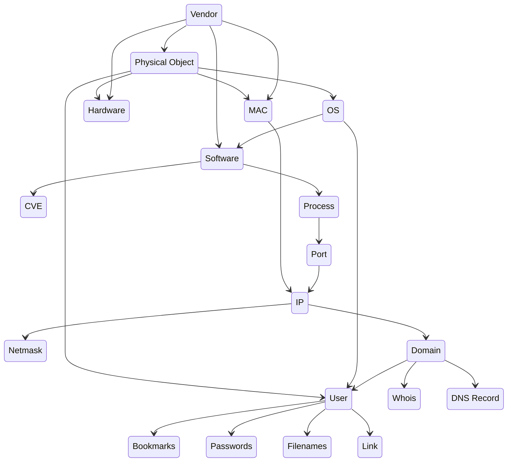
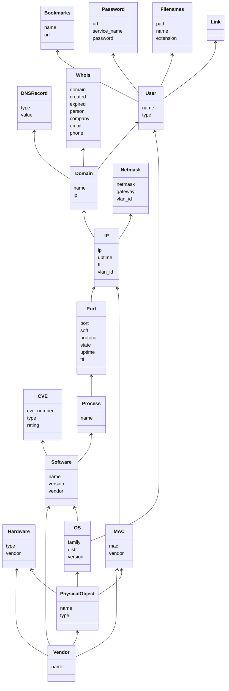

```mermaid
stateDiagram-v2
	state "Physical Object" as obj
	state "MAC" as mac
	state "IP" as ip
	state "Netmask" as netmask
	state "Port" as port
	state "Domain" as domain
	state "Software" as soft
	state "CVE" as cve
	state "Process" as proc
	state "User" as user
	state "Bookmarks" as bokms
	state "Passwords" as pass
	state "Filenames" as files
	state "Link" as link
	state "Whois" as whois
	state "DNS Record" as  dns
	state "Hardware" as hdwr
	state "OS" as os
	state "Vendor" as vendor
	

	vendor --> obj
	obj --> mac
	obj --> hdwr
	obj --> os
	vendor --> hdwr
	mac --> ip
	vendor --> mac
	port --> ip
	soft --> cve
	soft --> proc
	vendor --> soft
	ip --> domain
	ip --> netmask
	domain --> whois
	domain --> dns
	obj --> user
	user --> bokms
	user --> pass
	user --> files
	user --> link
	proc --> port
	os --> soft
	os --> user
	domain --> user
	
```

```mermaid
classDiagram
	class Physical Object{
		name
		type
	}
	class Hardware{
		type
		vendor
	}
	class MAC{
		mac
		vendor
	}
	class IP {
		ip
		uptime
		ttl
		vlan_id
	}
	class Domain{
		name
		ip
	}
	class DNS Record{
		type
		value
	}
	class Whois{
		domain
		created
		expired
		person
		company
		email
		phone
	}
	class Software{
		name
		version
		vendor
	}
	class Netmask{
		netmask
		gateway
		vlan_id
	}
	class Vendor{
		name
	}
	class Port{
		port
		soft
		protocol
		state
		uptime
		ttl
	}
	class CVE{
		cve_number
		type
		rating
	}
	class Process{
		name
	}
	class User{
		name
		type
	}
	class OS{
		family
		distr
		version
	}
	class Link{
		
	}
	class Password{
		url
		service_name
		password
	}
	class Bookmarks{
		name
		url
	}
	class Filenames{
		path
		name
		extension
	}

	Physical Object <-- Vendor
	MAC <-- Physical Object
	Hardware <-- Physical Object
	OS <-- Physical Object
	Software <-- OS
	Software <-- Vendor
	MAC <-- Vendor
	IP <-- MAC
	IP <-- Port
	Netmask <-- IP
	Process <-- Software
	CVE <-- Software
	Port <-- Process
	Domain <-- IP
	DNS Record <-- Domain
	Whois <-- Domain
	User <-- OS
	User <-- Domain
	Link <-- User
	Filenames <-- User
	Password <-- User
	Bookmarks <-- User
	Hardware <-- Vendor
```
